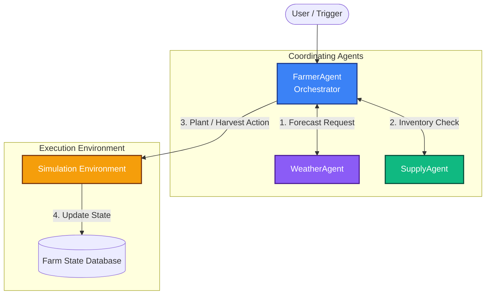

# Multi-Agent Kaggriculture Simulation & SDD Conformance Suite
### Kaggle × Google 5-Day AI Agents Intensive Capstone Submission (June 2026)

This repository documents my learning journey and final Capstone Project for the **5-Day AI Agents: Intensive Vibe Coding Course with Google**. 

It implements a cooperative multi-agent farming simulation environment (**Kaggriculture**) and a **Spec-Driven Development (SDD)** conformance testing suite.

---

## 🏗️ System Architecture & Flow

The repository implements a decentralized coordination loop containing three specialized agents and a stateful environment runner:



---

## 🎯 Course Concepts Demonstrated (6/6 Pillars)

This project implements all core themes taught during the Google Intensive:

1.  **Multi-Agent Coordination (Day 1 / Day 5):** Cooperative loops in [`day-5/code/capstone_simulation.py`](./day-5/code/capstone_simulation.py) where the `FarmerAgent` orchestrates inputs from the `WeatherAgent` and `SupplyAgent` to manage crops.
2.  **Model Context Protocol (MCP) Tools (Day 2):** Architecture for decoupling server tools and host client queries in [`day-2/code/mcp_server.py`](./day-2/code/mcp_server.py).
3.  **Context & Agent Skills (Day 3):** Standardized, discoverable instructions via [`day-3/code/skills/data_cleansing_skill.md`](./day-3/code/skills/data_cleansing_skill.md).
4.  **Observability & Tracing (Day 4):** Latency and prompt tracing setup in [`day-4/code/eval_suite.py`](./day-4/code/eval_suite.py).
5.  **Security Guardrails (Day 4):** Execution sandboxing in [`day-4/code/sandbox_runner.py`](./day-4/code/sandbox_runner.py).
6.  **Spec-Driven Development (Day 5):** Validating agent behaviors against declarative Gherkin specs ([`expense_agent_spec.feature`](./day-5/code/expense_agent_spec.feature)) using a Python conformance runner ([`test_agent_conformance.py`](./day-5/code/test_agent_conformance.py)).

---

## 📂 Repository Directory Map

```text
Kaggle-Google-AI-Agents-2026/
├── README.md                   # Core documentation (this file)
├── day-1/
│   ├── README.md               # Shifting from chatbots to autonomous loops
│   └── code/                   # Simple agent loops
├── day-2/
│   ├── README.md               # Model Context Protocol (MCP) tool design
│   └── code/                   # mcp_server.py & client verification scripts
├── day-3/
│   ├── README.md               # Memory storage & context engineering
│   └── code/                   # custom skill templates & context pruners
├── day-4/
│   ├── README.md               # Evaluation frameworks & guardrails
│   └── code/                   # Sandbox execution & input sanitizer scripts
└── day-5/
    ├── README.md               # Prototype to Production lifecycle
    ├── code/
    │   ├── capstone_simulation.py      # Kaggriculture Multi-Agent loop
    │   ├── expense_agent_spec.feature # Gherkin behavior specifications
    │   ├── test_agent_conformance.py  # Conformance test validation runner
    │   ├── deploy_reasoning_engine.py # Vertex AI Reasoning Engine deploy script
    │   └── frontend-app/              # Glassmorphic client app (HTML/CSS/JS)
    └── notes/
        ├── capstone_writeup.md        # Formatted Kaggle submission writeup
        └── gcp_setup_guide.md         # GCP SDK & API enablement guide
```

---

## ⚡ Setup & Installation

Follow these steps to run the simulation and verification suites locally:

### 1. Clone the repository
```bash
git clone https://github.com/pratapashanmukhi/Kaggle-Google-AI-Agents-2026.git
cd Kaggle-Google-AI-Agents-2026
```

### 2. Run the Capstone Multi-Agent Simulation
No cloud billing configuration is required to execute the mock environment simulator locally:
```bash
python day-5/code/capstone_simulation.py
```
*This outputs the step-by-step reasoning thought loops, tool requests, and state changes of the agents.*

### 3. Run the Spec Conformance Suite
Verify that the system complies with Gherkin specification rules:
```bash
python day-5/code/test_agent_conformance.py
```

### 4. Open the Observability Frontend App
Double-click the HTML file to run the interactive dashboard in your browser:
*   [`day-5/code/frontend-app/index.html`](./day-5/code/frontend-app/index.html)

---
*Developed for the Google Cloud & Kaggle Intensive. Code template provided for Placement Portfolios.*
