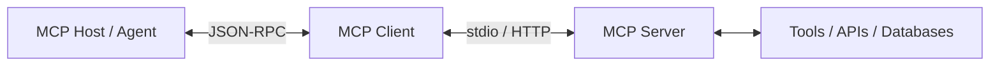

# Day 2: Agent Tools & Interoperability (MCP)

## 🎯 Focus & Objective
Day 2 focused on enabling agents to interact with the real world by giving them **tools**. We deep-dived into the **Model Context Protocol (MCP)**, a standard protocol that decouples LLM client interfaces from backend tool execution, making agentic integrations modular, safe, and highly extensible.

---

## 🧠 Key Concepts Learned

### 1. Model Context Protocol (MCP) Architecture
MCP separates the agent application from the data sources and execution environments. It consists of three parts:
*   **MCP Host:** The client application or agent workspace (e.g., Cursor, Antigravity, or custom app) that prompts the LLM.
*   **MCP Client:** A connection wrapper within the host that communicates with the MCP server over standard input/output or HTTP/SSE.
*   **MCP Server:** A lightweight backend service that exposes specific resources, prompts, and tools to the client.

### 2. Schema-Driven Tool Calling
*   The LLM does not run tools directly.
*   Instead, the MCP server describes available tools using standard JSON Schemas (defining tool names, descriptions, and expected parameters).
*   The LLM reads the description, decides which tool to call, and returns a structured JSON payload.
*   The MCP host executes the tool via the MCP server and feeds the results back to the LLM.

### 3. Creating Custom MCP Servers
We learned how to write custom MCP servers in Python (using the `mcp` SDK) or Node.js to expose local utilities (like file searching, database querying, or third-party API integration) directly to our agent.

---

## 💻 Code & Implementation
In the [`code/`](./code) folder, you will find:
*   `mcp_server.py`: A Python-based custom MCP Server exposing tools for querying local SQLite databases or calling weather APIs.
*   `test_tool_calling.py`: A script verifying that the client successfully negotiates protocol capabilities and routes LLM tool requests correctly.

---

## 📸 Suggested Screenshots to Include
When customizing this repo, upload the following screenshots to the `screenshots/` directory:
1.  **`mcp_tool_schema.png`**: An image or console printout showing the JSON-RPC schema negotiating tool definitions between client and server.
2.  **`successful_tool_execution.png`**: A screenshot showing the terminal output where the LLM issued a tool call, the server executed it, and the LLM used the output to answer the query.

---
*Next: [Day 3: Agent Skills & Context Engineering](../day-3/README.md)*
